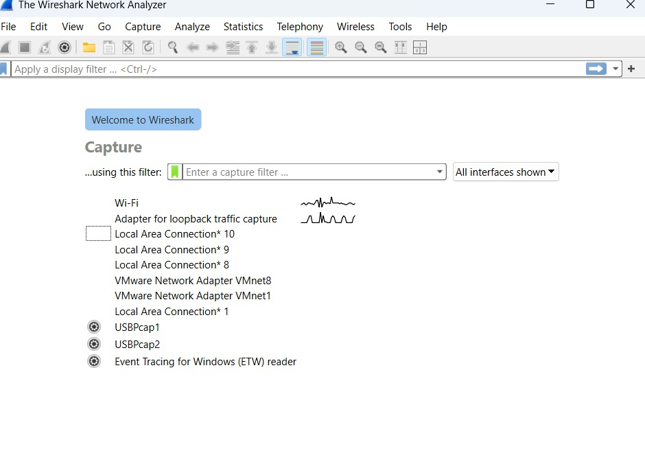
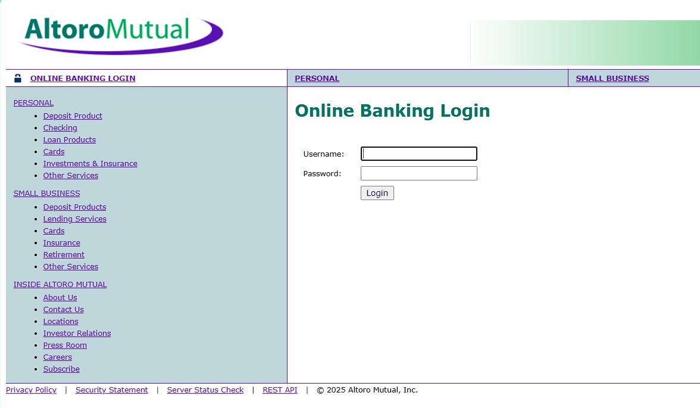
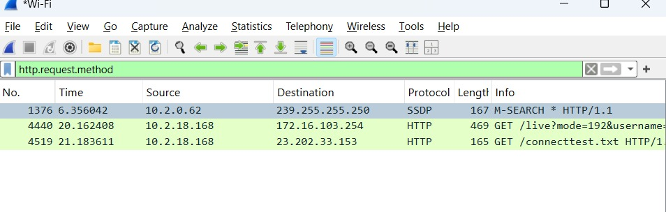
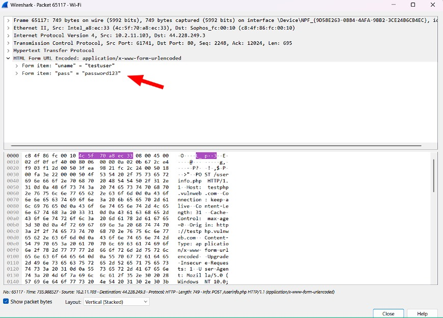

# Ex.No.3 — Wireshark: Capturing and Analyzing Network Traffic

🌐 **Test Website Used:** [http://demo.testfire.net/](http://demo.testfire.net/)

---

## 🎯 Aim
To demonstrate how **Wireshark** can capture unencrypted network traffic and reveal sensitive information, such as usernames and passwords, transmitted over an insecure HTTP connection.

---

## 📋 Procedure

### 🔹 Step 1: Begin Packet Capture
- Launch **Wireshark** on your system.  
- A list of available **network interfaces** (e.g., Wi-Fi, Ethernet) will be displayed.  
- Select the interface through which you are connected to the internet.  

 

- Start the live capture by clicking the **blue shark fin icon 🦈**.  
- Wireshark will now begin recording all packets flowing through the selected interface.  

---

### 🔹 Step 2: Perform Login on Test Website
- Open a browser and visit **http://demo.testfire.net/**.  
- Enter some dummy credentials (for demonstration):  

- Submit the login form. The authentication will fail, but the request containing the credentials will already be transmitted across the network.  

📌 **Note:** Since the site uses **HTTP**, all form data is sent in cleartext.

---

### 🔹 Step 3: Stop Capture and Apply Filters
- Return to Wireshark and click the **red square button** to stop packet capture.  
- In the filter bar, type the following to isolate HTTP POST requests:  

- Press **Enter** to apply the filter. This will display only the packets that contain login submissions.  

---

### 🔹 Step 4: Analyze Packets
- From the filtered results, select the relevant **HTTP POST packet** (usually `/userinfo.php`).  
- Expand the following sections in the **Packet Details** panel:  
  - `Hypertext Transfer Protocol`  
  - `Form item: username`  
  - `Form item: password`  

- The credentials entered on the website will appear in plaintext within the packet data.  

---

## ✅ Observation
- The captured packet clearly shows the **username and password** in plaintext.  
- This proves that **unencrypted HTTP traffic** is vulnerable to interception.  

---

## 📌 Key Learnings
- **HTTP is insecure**: Any data transmitted can be intercepted and read.  
- **HTTPS is secure**: Credentials would be encrypted with TLS, preventing packet sniffing attacks.  
- **Wireshark** is an effective tool for:  
  - Network troubleshooting  
  - Forensic investigation  
  - Security testing  

---

## 📚 References
- [Wireshark Documentation](https://www.wireshark.org/docs/)  
- Stallings, W. (2013). *Network Security Essentials*.  
- Hands-on practices from lab experiments.  

