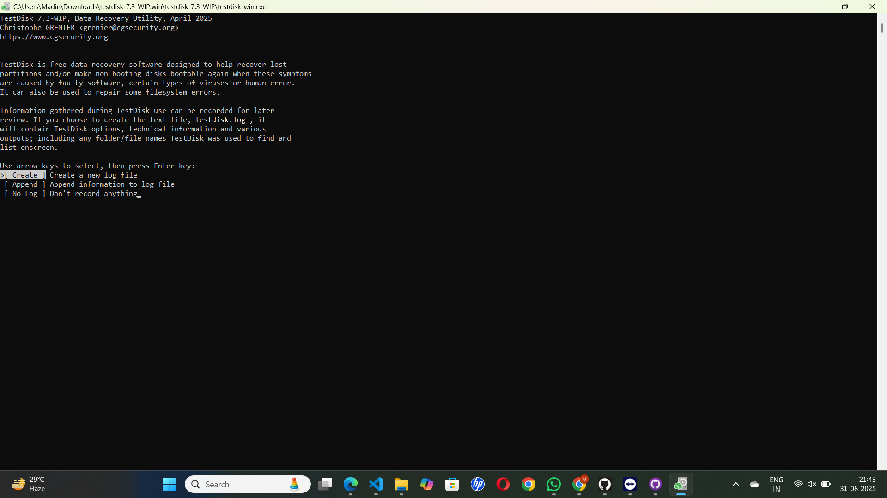
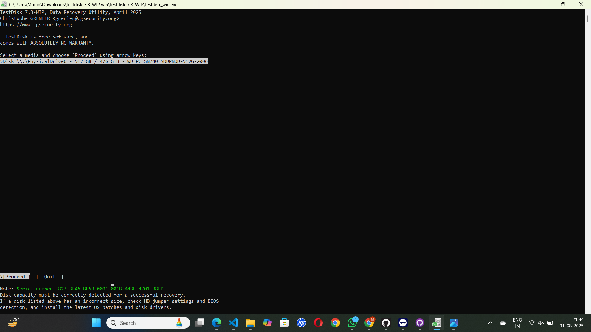
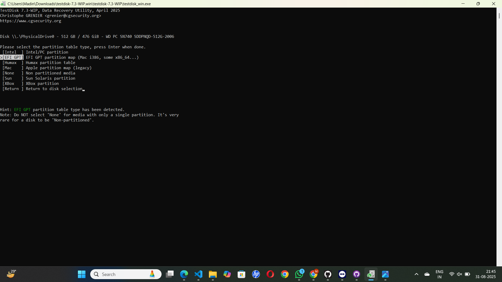
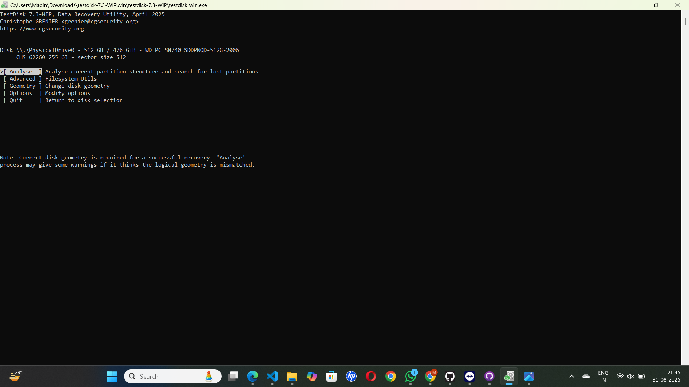
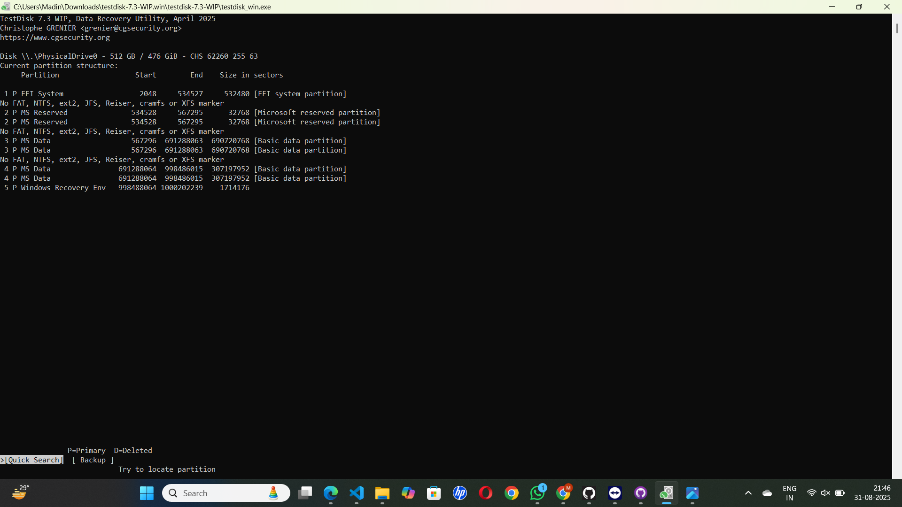
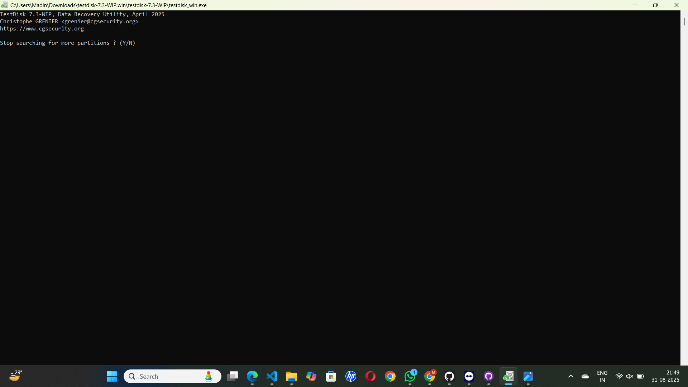

# Ex.No.2 — TestDisk: Open-Source Data Recovery Tool (Detailed Guide)

---

## Aim
To use **TestDisk**, an open-source utility, to recover lost partitions, repair damaged boot sectors, and restore deleted files while ensuring data integrity.

---

## Procedure

### Step 1: Launch TestDisk
- Open TestDisk from terminal or command prompt.  
- On Windows: run `testdisk_win.exe`.  
- On Linux/macOS: run `sudo testdisk`.  
- The tool runs in **text-based interface (CLI)**.  

---

### Step 2: Create / Use Log File
- TestDisk will ask whether to **create a log file**:  
  - **[Create]** → generates a new log (recommended).  
  - **[Append]** → adds to existing log.  
  - **[No Log]** → skip logging.  
- Logs help track recovery steps and issues.

---

### Step 3: Select Disk
- TestDisk lists all connected drives and storage media.  
- Use arrow keys to choose the correct disk (not just a single partition).  
- Press **Enter** to continue.  

📌 Tip: Always double-check disk size to avoid selecting the wrong drive.  

---

### Step 4: Choose Partition Table Type
- TestDisk auto-detects the partition table (commonly **Intel/PC**, **EFI GPT**, or **Mac**).  
- Confirm the detected type or manually select if needed.  

---

### Step 5: Analyze Disk
- Select **[Analyze]** to check the partition structure.  
- TestDisk will display existing and lost partitions.  
- Run **[Quick Search]** to scan for lost partitions.  
- If partitions are still missing → run **[Deeper Search]**.  

⏳ Deep Search can take longer but finds more data.  

---

### Step 6: Recover / Write Partition
- Highlight the correct lost partition.  
- Press **P** to list files and verify contents.  
- If valid → choose **[Write]** to restore the partition table.  
- Reboot the system after writing changes.  

⚠️ If unsure, don’t write changes yet — instead copy files first.

---

### Step 7: File Recovery (Optional)
- Navigate into the lost partition using **P** (list files).  
- Use arrow keys to select files/directories.  
- Press **C** to copy them.  
- Select a **safe destination folder** on another drive for saving.  

⚠️ Never copy recovered files back to the same drive to prevent overwriting.  

---

## Notes
- ⚠ Always recover data to a **different physical drive**.  
- ✅ Verify recovered files before finalizing.  
- ⏳ Deeper Search increases recovery accuracy but takes more time.  
- 🛠 TestDisk is especially effective for:  
  - Lost partition recovery  
  - Repairing boot sectors (FAT/NTFS)  
  - Restoring deleted partitions  

---

## References
- [TestDisk Official Website](https://www.cgsecurity.org/wiki/TestDisk)  
- TestDisk Step-by-Step Guide — cgsecurity.org  
- Casey, E. (2011). *Digital Evidence and Computer Crime*.  

