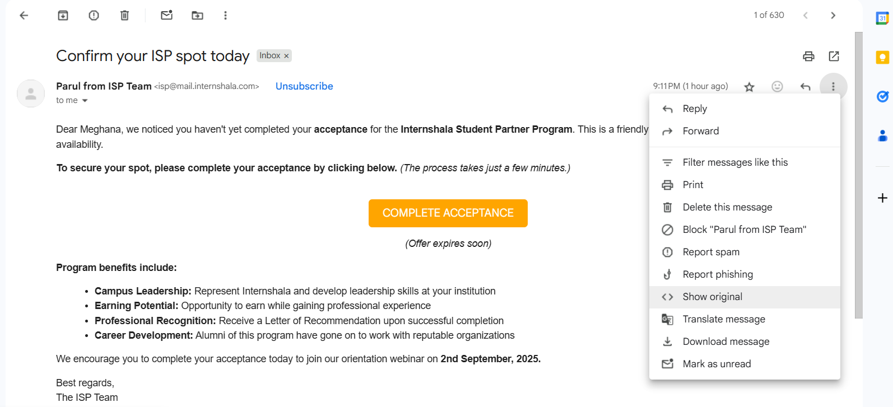

# Ex.No.4 — Mail Header Analyzer (MHA)  
🌐 **Tool Used:** [MxtoolBox](https://mxtoolbox.com/EmailHeaders.aspx)

---

## 🎯 Aim
To analyze an email header using a **Mail Header Analyzer (MHA)** in order to verify authenticity, trace routing information, and check for spoofing attempts.

---

## ⚙️ Procedure

### 🔹 Step 1: Extract the Raw Header
- From your email client, copy the **full header information**.  
- Example:  
  - **Gmail:** Open the message → Click the three-dot menu → Select **“Show Original”**.  
- Save the copied header text for analysis.  

 

---

### 🔹 Step 2: Submit the Header to Analyzer
- Open [MxtoolBox](https://mxtoolbox.com/).  
- Paste the header data into the analyzer.  
- Click **Analyze** to generate the report.  

 

---

### 🔹 Step 3: Review Authentication Checks
- The analyzer provides results for:  
  - **SPF (Sender Policy Framework)**  
  - **DKIM (DomainKeys Identified Mail)**  
  - **DMARC (Domain-based Message Authentication Reporting & Conformance)**  

 

- These checks confirm whether the message is legitimate or spoofed.  

---

### 🔹 Step 4: Trace Email Path
- Examine the **Received** fields to view the relay path.  
- Verify that the sending server IPs match authorized domains.  
- Check for unusual or suspicious hops.  

 

---

## 📑 Observations from Sample Header

### Example Subject:
**“Reset your Olympus password”**

### Authentication Report:
| Method | Status | Notes |
|--------|--------|-------|
| SPF    | ✅ Pass | Sending IP (149.72.189.153) allowed for domain. |
| DKIM   | ✅ Pass | Signature validated, no tampering detected. |
| DMARC  | ✅ Pass | Alignment verified, policy enforced. |

---

### Delivery Path Summary:
- **Origin Server:** `olympus.greatlearning.in (149.72.189.153)`  
- **Intermediate Relay:** `wrqvbdww.outbound-mail.sendgrid.net`  
- **Destination:** `mx.google.com` (Google Mail Server)  
- **Final Delivery:** Recipient inbox  

| Hop | Delay | Source | Destination |
|-----|-------|---------|-------------|
| 1   | 0s    | olympus.greatlearning.in | relay node |
| 2   | 0s    | outbound-mail.sendgrid.net | Google MX |
| 3   | 0s    | Google MX | Recipient |

---

## 📌 Technical Breakdown
- **From / To / Date / Subject:** Basic sender–receiver info.  
- **Received Fields:** Traceable route taken by email.  
- **Return-Path vs. From:** Used to detect spoofing attempts.  
- **SPF/DKIM/DMARC:** Cryptographic authentication mechanisms.  
- **Message-ID:** Unique identifier for tracking a specific email.  
- **X-Spam-Score:** Spam likelihood based on filtering engine.  

---

## ✅ Result
- All three authentication mechanisms (SPF, DKIM, DMARC) passed successfully.  
- The email shows **no evidence of tampering or spoofing**.  
- Minor mismatches in Return-Path vs. From may exist but are not malicious.  

**Final Conclusion:**  
The analyzed email is verified as **authentic and safe**, with no indications of forgery or compromise.  

